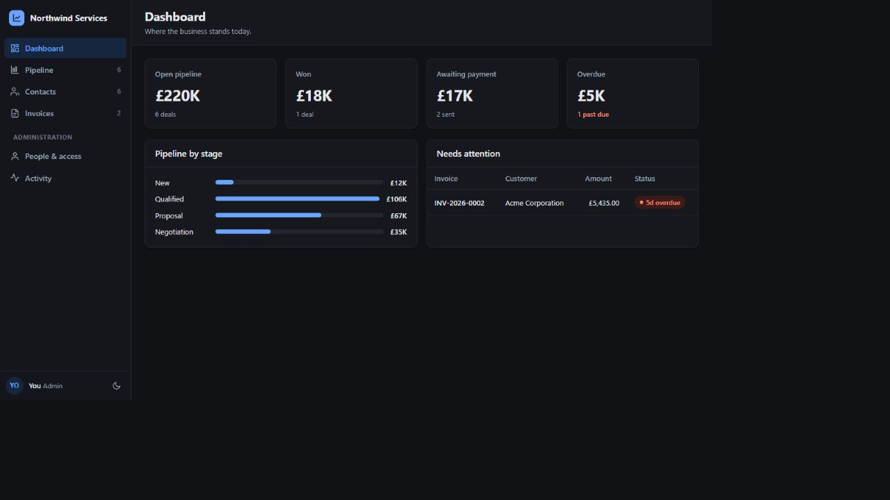
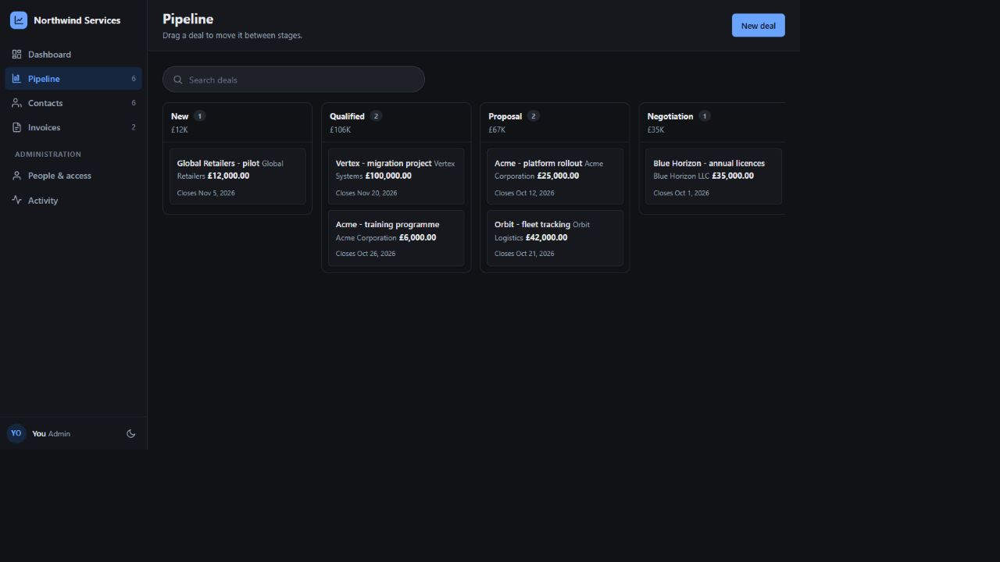
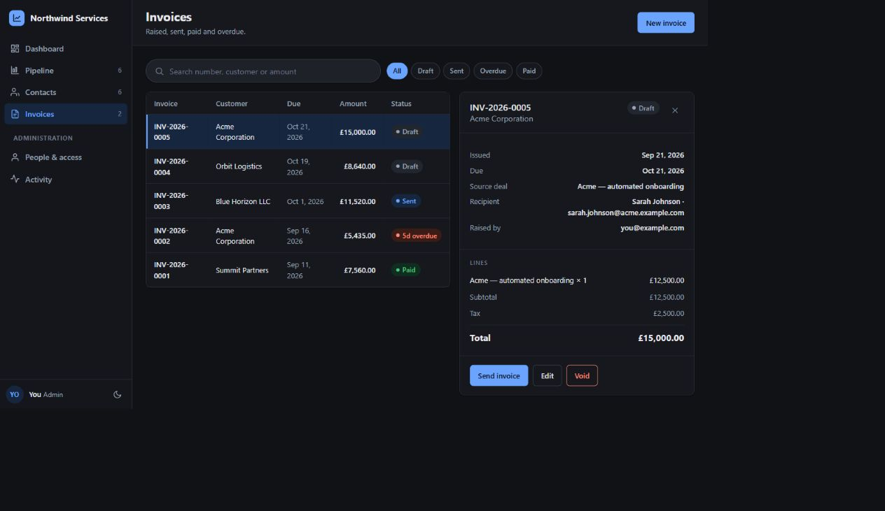
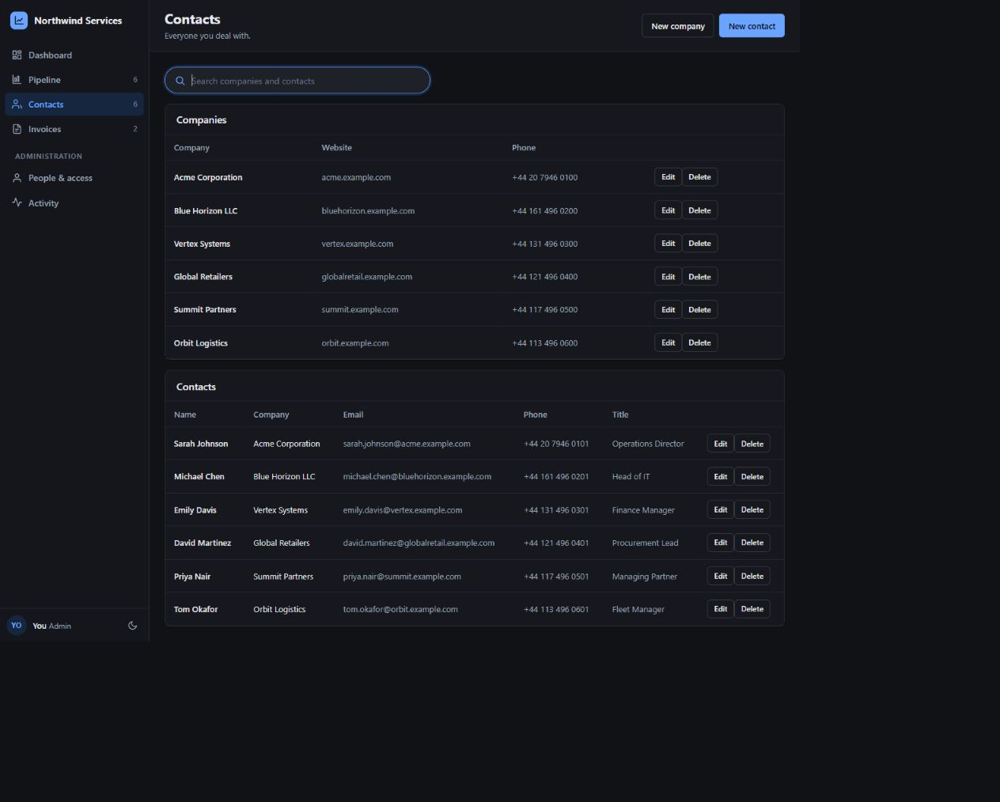
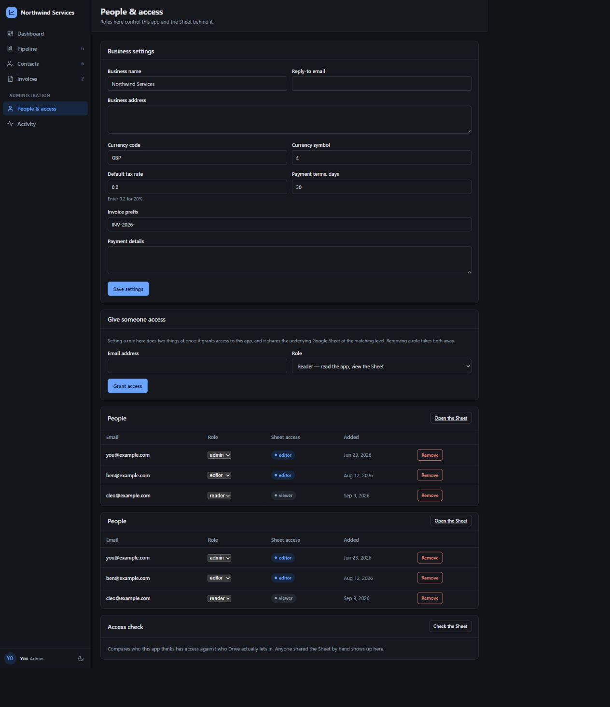

# Google Sheets CRM & Automated Invoicing

A product case study and selected code samples for a secure Google Sheets-backed CRM and invoicing web app built with Google Apps Script.

> The complete production source, data model, deployment configuration, and operational documentation are private. The code under `samples/` is simplified and intentionally non-deployable.

## The product

The application gives a small business one workspace for customer records, sales opportunities, invoices, payments, access control, and activity history.

### Highlights

- Dashboard for pipeline, won revenue, awaiting payment, and overdue invoices.
- Companies and contacts with responsive search.
- Visual drag-and-drop sales pipeline.
- Automatic draft invoice creation when a deal is won.
- Automatic customer, recipient, value, tax, issue date, and due-date population.
- Invoice PDF generation and email delivery after recipient confirmation.
- Paid, sent, draft, void, and overdue invoice states.
- Scheduled overdue reminders.
- Admin, editor, and reader access levels.
- Audit history and access-drift checks.
- Responsive light and dark interface.

## Product workflow

The won-deal action creates one linked draft invoice without requiring a separate conversion step. Repeated saves do not create duplicates. Email remains deliberate so the operator can verify the exact recipient first.

## Screenshots

### Searchable sales pipeline

### Automatically populated invoice

### Customer directory

### Role-based administration

## Technology

- Google Apps Script
- Google Sheets
- Google Drive and Google Docs
- JavaScript, HTML, and CSS
- Server-side authorization
- Automated rules testing
- Git-based development and versioned releases

## Engineering focus

- Financial calculations use integer minor units to avoid floating-point errors.
- Authorization is enforced by server endpoints, not only by hidden interface controls.
- Invoice creation is idempotent and linked to its originating deal.
- Derived states such as overdue status are calculated from authoritative dates.
- Write operations are guarded to prevent duplicate or conflicting updates.
- User-provided values are rendered as text rather than injected as HTML.

## Selected code

- [Financial calculation sample](samples/invoice-calculation.sample.js)
- [Authorization sample](samples/authorization.sample.js)

These excerpts demonstrate coding style only. Names and implementation details were changed, and the samples do not contain the production data model or deployable application logic.

## More detail

- [Case study](docs/CASE-STUDY.md)
- [Architecture overview](docs/ARCHITECTURE-OVERVIEW.md)
- [Changelog](CHANGELOG.md)

