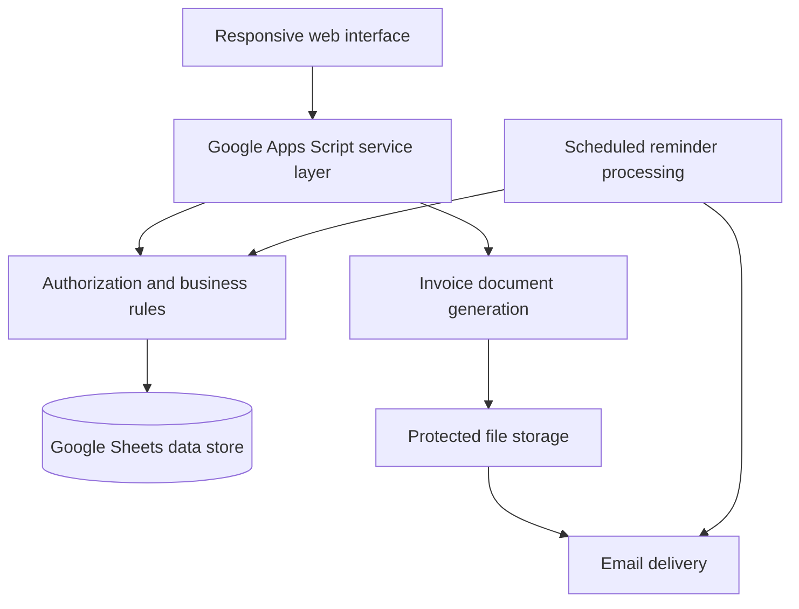

# Architecture overview

This is a deliberately high-level overview. Production source, schemas, identifiers, scopes, and deployment configuration are private.

## Design decisions

### Spreadsheet-backed storage

The business can inspect and export its operational data using familiar tools, while the application provides validation and workflow controls above the raw tables.

### Server-enforced access

The browser only presents permitted controls, but the service layer independently verifies every read and write. Interface visibility is treated as usability, not security.

### Idempotent workflow operations

Business actions that may be repeated—such as saving a won opportunity—use stable relationships to prevent duplicate downstream records.

### Explicit external communication

Internal record creation can be automatic. Customer-facing email remains explicit and displays the destination before sending.

### Derived time-sensitive state

Overdue status is calculated from invoice state and dates rather than stored as a flag that could become stale.

